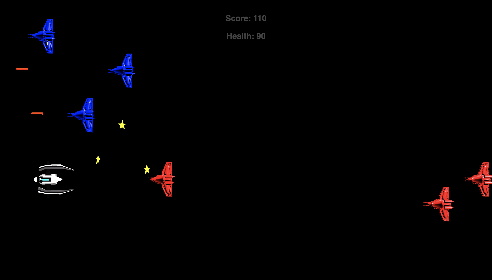

# Space Wars
<i>It's time you buckle up your seat belts. The Space Wars have started and, you are their only hope!</i>

## How to run

1. Run `git clone https://github.com/alapan-sau/Space-Wars` to download the game.

2. Run `npm install` inside the repository

3. Run `npm start` to start the game in the default browser

```shell
$ git clone https://github.com/alapan-sau/Space-Wars
$ cd Space-Wars
$ npm install
$ npm start
```



## Features

1. A battle spaceship has to score as many points as possible, by destroying enemy battle ships and collecting stars

2. Misslies are used to shoot the enemies. Howewer, Enemy ships also try and shoot!

3. Score and Health is Diplayed at the top of screen.

4. The enemy ships can move along with the hero ship to increase difficulty.

5. 3D animations, to glorify the asthetics of the game


## Scoring Policy

The game starts with an initial `Health = 100` and `Score = 0`

- Shooting Enemy: `Score+=50`
- Collecting Star: `Score+=10`
- Getting Shot: `Health-=10`
- Coolliding Enemy ships: `Health-=20`

## Game Controls

 <kbd>Up</kbd>: Move upwards on screen (Move Left) <br>
 <kbd>Down</kbd>: Move Downwards on screen (Move Right) <br>
 <kbd>Right</kbd>: Move Rightwards on screen (Move Front) <br>

<kbd>Left</kbd>: Move Leftwards on screen (Move Back) <br>


## File Structure

`index.html` The html anchor where the game canvas element is present <br>
`src/main.js` The main file of the game logic <br>
`src/World/World/.js` All the components of the game are actually built and organised here. <br>
`src/World/World/Componenets` The various components of the game like hero, enemy, missile are individually implemented in this dir <br>
`src/World/World/system` The system dir organises the actual logic of the code by specifying the interaction among the various models <br>
`src/World/World/system/Loop` The central gaming loop

## Trailer
<a href="https://iiitaphyd-my.sharepoint.com/:v:/g/personal/alapan_sau_students_iiit_ac_in/Eae0_5UABcxCmWR0WnYm6iMBsOKVxBBGaR2PYDkT49rSbQ?e=0cqU13">A trailer to the game is added here</a>

The trailer animatons are made using the Blender Grpahics Tool.
